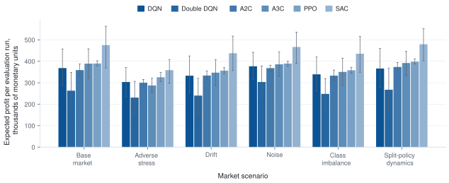
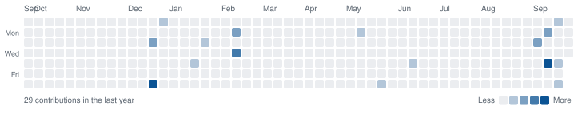
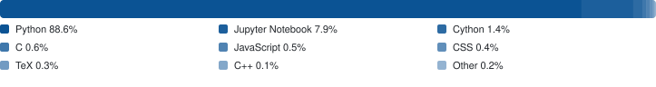

# Evgeny Baulin

Lecturer at the Faculty of Computer Science, HSE University, teaching optimization and machine learning in the Applied Data Analysis programme. My research applies reinforcement learning to consumer credit risk, with a focus on acceptance policies that hold up under capital constraints and delayed repayment outcomes

## About

- **Teaching.** Optimization Methods in the Applied Data Analysis / DSBA programme at HSE FCS since September 2026, and Machine Learning in the same programme from January 2027
- **Education.** BSc in Applied Data Analysis, HSE FCS (2022–2026), diploma GPA 7.85/10. MSc in Financial Technologies and Data Analysis, HSE FCS (2026–2028, in progress). BSc EMFSS, University of London, distance learning with academic direction by LSE (2024–2027, in progress)
- **Research interests.** Reinforcement learning for credit scoring, portfolio-level risk control, and simulation-based policy evaluation
- **Availability.** Open to roles in data and risk analytics, machine learning, and applied research

## Research

**Paper.** _Reinforcement Learning vs. Rule-Based Policies for Dynamic Credit Threshold Control: A Simulation Study_ — E. Baulin, P. P. Lukianchenko. Submitted to _Expert Systems with Applications_, under review. Written with my academic advisor from the Center for Trusted AI at ISP RAS

**Thesis** ([repository](https://github.com/EvgenyBaulin/Evaluation-of-RL-framework-in-a-credit-scoring-problem), defended June 2026). I built a simulation environment that treats consumer credit scoring as a weekly control problem: each week the lender sets application-acceptance thresholds, separately for new and returning customers, and only learns the consequences once loans mature. The environment models capital constraints and scores policies on profit, net present value, default rate and approval rate, and is calibrated against Bank of Russia, ECB and Lending Club data. Six agents — DQN, Double DQN, A3C, A2C, PPO and SAC — were compared with static and rule-based baselines across 6 market scenarios and 4 state dimensionalities (12, 20, 30 and 50 features), for a total of 1,152 training runs

<picture>
  <source media="(prefers-color-scheme: dark)" srcset="assets/rl-thresholds-dark.svg">
  
</picture>

## Stack

- **Languages** — Python, SQL, C++, TypeScript / JavaScript, Swift, Kotlin, LaTeX
- **ML and DS** — PyTorch, scikit-learn, Stable-Baselines3, HuggingFace Transformers, MLflow, NumPy, pandas, SciPy, statsmodels, Matplotlib, Seaborn
- **Backend** — FastAPI, Django REST Framework, Tortoise ORM, aiogram
- **Data** — PostgreSQL, MySQL, MS SQL, ClickHouse, Greenplum, Apache Airflow, dbt
- **Analytics** — A/B testing, econometrics, Power BI, Apache Superset, Amplitude, Mixpanel, Yandex.Metrica, AppMetrica
- **Frontend and native** — Vue 3, Pinia, Vite, SwiftUI, AppKit
- **Infrastructure** — Docker, Docker Compose, Redis, Caddy, Git

## Activity

<picture>
  <source media="(prefers-color-scheme: dark)" srcset="assets/contrib-heatmap-dark.svg">
  
</picture>

<picture>
  <source media="(prefers-color-scheme: dark)" srcset="assets/lang-stats-dark.svg">
  
</picture>
